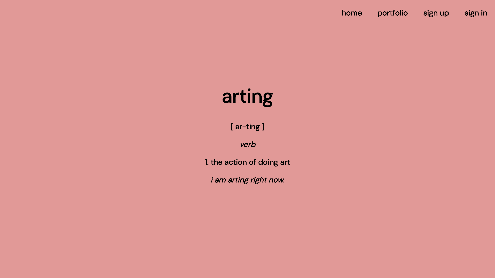
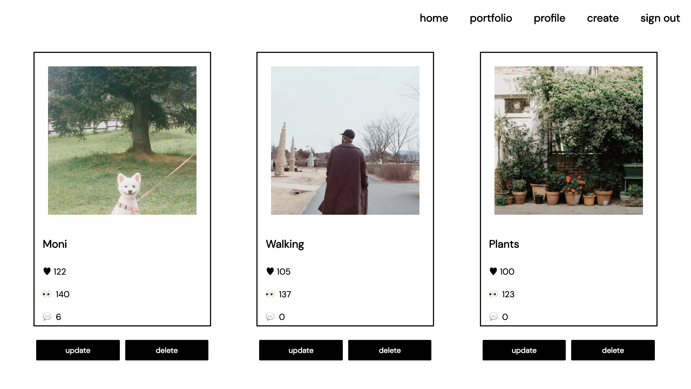
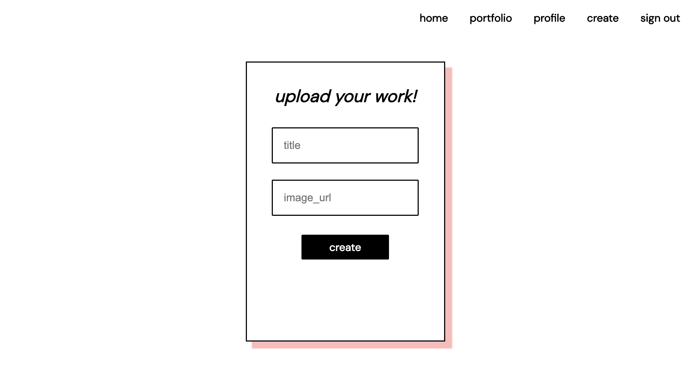

# arting

### By: Jady Hom

***

### Description
**arting**

[ ar-ting ]

*verb*

1. The action of doing art.

*I am arting right now.*

Arting is a website platform for users to showcase and post any of their portfolio and works. Users will be able to create and view artboards. 

***

### Technologies Used
* HTML / CSS / Javascript
* React
* Node
* Express
* Mongoose
* MongoDB

***

### Getting Started

Get started by signing up! You can then begin uploading into your profile and showcase your works in the portfolio page!

Here is [My Trello Board](https://trello.com/b/snLYqikj) - where I kept track of the process of creating this website.

***

### User Stories
* Users will be able to see main page
* Users will be able to see a nav bar - Home, Portfolio, Sign Up, Sign In
* Users will be able to navigate between pages
* Users will be able to click on Sign Up to create an account
* Users will be able to Sign In to their account
* Users will be able to create, read, update, and delete artboards
* Users will be able to show their works on the website

***

### ERD - Entity Relationship Diagram

***

### Component Hierarchy Diagram

***

### Wireframe
Initial Mockup/Wireframe

***

### Screenshots
Final Mockup/Wireframe

**Main Page**

**Portfolio Page**

**Profile Page**

**Sign Up Page**

**Sign In Page**

**Viewing Board**

**Create/Upload Form**

**Update Form**

***

### Future Updates

- [ ] Add Profile section to Profile Page
- [ ] Input more data using model/schema
- [ ] Style a different User Interface
- [ ] CSS Modal Boxes
- [ ] Add Commenting function to frontend

***

### Credits
[Trello Board](trello.com)

[Netlify](https://www.netlify.com/)

[LucidChart](https://www.lucidchart.com/)

[Pexels](https://www.pexels.com/)
Photography Credits: 
* gya den
* Daria Shevtsova
* Piyapong Sayduang
* Aldo Picaso
* Inga Seliverstova
* Bulutsadehanim
* Justin Anthony Balaguer I
* Lydia Bond
* eberhard grossgasteiger
* cottonbro
* fotografierende