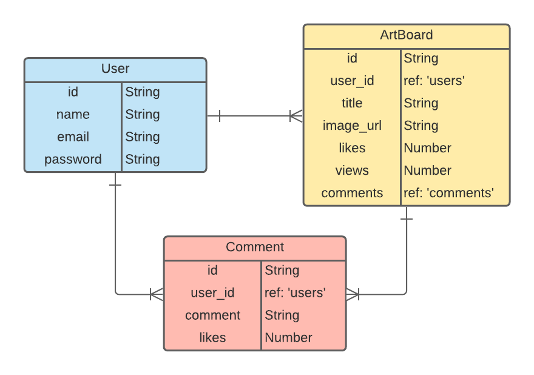

# arting

### By: Jady Hom
***

### Overview
**arting**

[ ar-ting ]

*verb*

1. The action of doing art.

*I am arting right now.*

Arting is a website platform for users to showcase their portfolio and work. Users will be able to create and view artboards. 

***

### Technologies Used
* HTML / CSS / Javascript
* React
* Node
* Express
* Mongoose
* MongoDB
***

### Getting Started

Get started by signing up and creating a profile. You can then begin creating artboards in your profile and showcase your works!

Here is [My Trello Board](https://trello.com/b/snLYqikj.com) - where I kept track of the process of creating this website.
***

### User Stories
* Users will be able to see homepage
* Users will be able to see a nav bar - Art Boards, Sign In, Sign Up
* Users will be able to click on Sign Up to create an account
* Users will be able to Sign In to their profile
* Users will be able to view their profile
* Users will be able to create, add, update, and delete artboards
* Users will be able to view, like, and comment artboards
***

### ERD - Entity Relationship Diagram

***

### Component Hierarchy Diagram

***

### Wireframe
Initial Mockup/Wireframes

***

### Screenshots

***

### Future Updates
- [ ] 
- [ ] 
- [ ] 
- [ ] 
***

### Credits
[Trello Board](trello.com)

[Netlify](https://www.netlify.com/)

[LucidChart](https://www.lucidchart.com/)